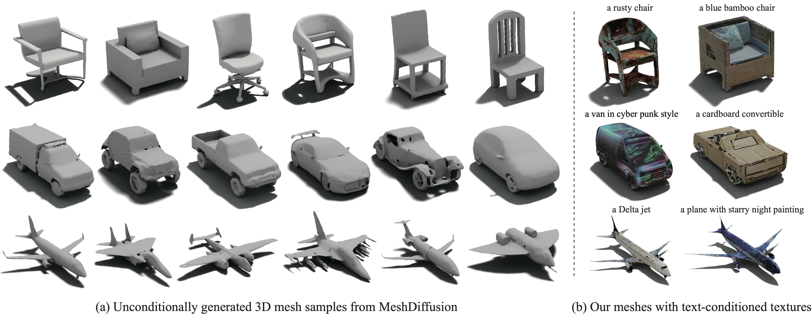
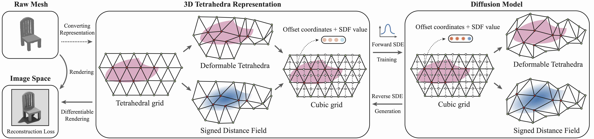

# MeshDiffusion: Score-based Generative 3D Mesh Modeling


<div align="center">
  
</div>

## Introduction

This is the official implementation of [MeshDiffusion](https://openreview.net/forum?id=0cpM2ApF9p6) (ICLR 2023 Spotlight).

MeshDiffusion is a diffusion model for generating 3D meshes with a direct parametrization of deep marching tetrahedra (DMTet). Please refer to [our project page](https://meshdiffusion.github.io) for more details and interactive demos.


<div align="center">
  
</div>

## Getting Started

### Requirements

- Python >= 3.8
- CUDA 11.6
- Pytorch >= 1.6
- Pytorch3D


Follow the instructions to install requirements for [nvdiffrec](https://github.com/NVlabs/nvdiffrec)

### Pretrained Models

Download our pretrained MeshDiffusion models (resolution 64) for [chair](https://keeper.mpdl.mpg.de/f/95640f5bd3764a44b907/?dl=1), [car](https://keeper.mpdl.mpg.de/f/061265ef78df494baaf5/?dl=1) and [airplane](https://keeper.mpdl.mpg.de/f/f5074d6b0cb24445a80d/?dl=1). As a backup option, you can also download the models for car and chair from [Google Drive](https://drive.google.com/drive/folders/15IjbUM1tQf8gS0YsRqY5ZbMs-leJgoJ0?usp=sharing).

Download the res-128 models here: [car](https://huggingface.co/lzzcd001/MeshDiffusion_models/blob/main/car_res128.pt) and [chair](https://huggingface.co/lzzcd001/MeshDiffusion_models/blob/main/chair_res128.pt).

### Datasets

We provide processed datasets (in the form of cubic grids) of resolution 64 in this [link](https://huggingface.co/datasets/lzzcd001/MeshDiffusion_DMTet_Dataset). The deformation scale for the datasets is set to 3.0, and the SDF values of all non-mesh-generating tetrahedral vertices are set to either 1 or -1 (depending on their signs), as described in the paper. The cubic grids with the boundary removed are of size 63x63x63 and padded on the right to 64x64x64 for convenience. Please check `eval.py` to see how to extract DMTet representations from the 3D cubic grids.

## Inference

### Unconditional Generation

Run the following

```
python main_diffusion.py --config=$DIFFUSION_CONFIG --mode=uncond_gen \
--config.eval.eval_dir=$OUTPUT_PATH \
--config.eval.ckpt_path=$CKPT_PATH
```

Later run

```
cd nvdiffrec
python eval.py --config $DMTET_CONFIG --out-dir $OUT_DIR --sample-path $SAMPLE_PATH --deform-scale $DEFORM_SCALE [--angle-ind $ANGLE_INDEX]
```

where `$SAMPLE_PATH` is the generated sample `.npy` file in `$OUTPUT_PATH`, and `$DEFORM_SCALE` is the scale of deformation of tet vertices set for the DMTet dataset (we use 3.0 for resolution 64 as default; change the value for your own datasets). Change `$ANGLE_INDEX` to some number from 0 to 50 if images rendered from different angles are desired.

A mesh file (`.obj`) will be saved to the folder, which can be viewed in tools such as MeshLab. The saved images are rendered from raw meshes without post-processing and thus are used for fast sanity check only.


### Single-view Conditional Generation

First fit a DMTet from a single view of a mesh positioned in its canonical pose

```
cd nvdiffrec
python fit_singleview.py --config $DMTET_CONFIG --mesh-path $MESH_PATH --angle-ind $ANGLE_IND --out-dir $OUT_DIR --validate $VALIDATE
```

where `$ANGLE_IND` is an integer (0 to 50) controlling the z-axis rotation of the object. Set `$VALIDATE` to 1 if visualization of fitted DMTets is needed.

Then use the trained diffusion model to complete the occluded regions

```
cd ..

python main_diffusion.py --mode=cond_gen --config=$DIFFUSION_CONFIG \
--config.eval.eval_dir=$EVAL_DIR \
--config.eval.ckpt_path=$CKPT_PATH \
--config.eval.partial_dmtet_path=$OUT_DIR/tets/dmtet.pt \
--config.eval.tet_path=$TET_PATH \
--config.eval.batch_size=$EVAL_BATCH_SIZE
```

, in which `$TET_PATH` is the uniform tetrahedral grid (of resolution 64 or 128) file in `nvdiffrec/data/tets`.

Now store the completed meshes as `.obj` files in `$SAMPLE_PATH`

```
cd nvdiffrec
python eval.py --config $DMTET_CONFIG --sample-path $SAMPLE_PATH  --deform-scale $DEFORM_SCALE
```

Caution: the deformation scale should be consistent for single view fitting and the diffusion model. Check before you run conditional generation.


## Training

For ShapeNet, first create a list of paths of all ground-truth meshes and store them as a json file under `./nvdiffrec/data/shapenet_json`.

Then run the following

```
cd nvdiffrec
python fit_dmtets.py --config $DMTET_CONFIG --meta-path $META_PATH --out-dir $DMTET_DATA_PATH --index 0 --split-size 100000
```

where `split_size` is set to any large number greater than the dataset size. In case of batch fitting with multiple jobs, change `split_size` to a suitable number and assign a different `index` for different jobs. Tune the resolutions in the 1st and 2nd pass fitting in the config file if necessary. `$META_PATH` is the json file created to store the list of meshes paths.

Now convert the DMTet dataset (stored as python dicts) into a dataset of 3D cubic grids:

```
cd ../data/
python tets_to_3dgrid.py --resolution $RESOLUTION --root $DMTET_DICT_FOLDER --source $SOURCE_FOLDER --target grid --index 0
```

in which we assume the DMTet dict dataset is stored in `$DMTET_DICT_FOLDER/$SOURCE_FOLDER` and we will save the resulted cubic grid dataset in `$DMTET_DICT_FOLDER/grid`.

Create a meta file of all dmtet 3D cubic grid file locations for diffusion model training:

```
cd ../metadata/
python save_meta.py --data_path $DMTET_DATA_PATH/tets --json_path $META_FILE
```

Train a diffusion model

```
cd ..

python main_diffusion.py --mode=train --config=$DIFFUSION_CONFIG \
--config.data.meta_path=$META_FILE \
--config.data.filter_meta_path=$TRAIN_SPLIT_FILE
```

where `$TRAIN_SPLIT_FILE` is a json list of indices to be included in the training set. Examples in `metadata/train_split/`. For the diffusion model config file, please refer to `configs/res64.py` or `configs/res128.py`.

## Texture Generation

Follow the instructions in https://github.com/TEXTurePaper/TEXTurePaper and create text-conditioned textures for the generated meshes.

## Others

If tetrahedral grids of higher resolutions are needed, first follow the README in `nvdiffrec/data/tets` and use [quartet](https://github.com/crawforddoran/quartet) to generate a uniform tetrahedral grid. Then run `nvdiffrec/data/tets/crop_tets.py` to remove the boundary (so that translational symmetry holds in the resulted grid).

## Blender Visualization

To visualize generated meshes with blender, please see `blender_viz/` for more details.

## Citation
If you find our work useful to your research, please consider citing:

```
@InProceedings{Liu2023MeshDiffusion,
    title={MeshDiffusion: Score-based Generative 3D Mesh Modeling},
    author={Zhen Liu and Yao Feng and Michael J. Black and Derek Nowrouzezahrai and Liam Paull and Weiyang Liu},
    booktitle={International Conference on Learning Representations},
    year={2023},
    url={https://openreview.net/forum?id=0cpM2ApF9p6}
}
```

## Acknowledgement

This repo is adapted from https://github.com/NVlabs/nvdiffrec and https://github.com/yang-song/score_sde_pytorch.
